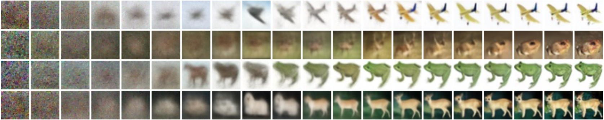
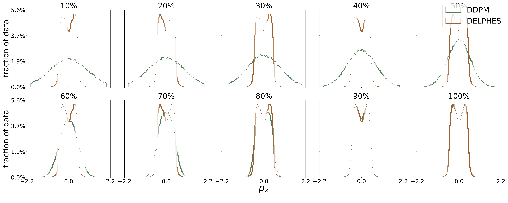
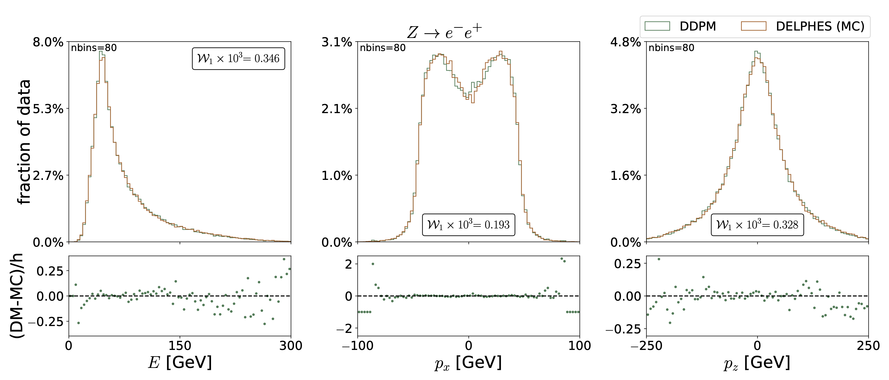

# Generating Particle Decays Using Denoising Diffusion Probabilistic Models at the CMS Experiment
## Bachelor’s thesis in physics by Paul Gilles
### III. Physics Institute A | superviser: Prof. Dr. Martin Erdmann

This is the code and all trained models used while writing my thesis. Modified-improved-diffusion-main is based on improved-diffusion-main by Alex Nichol et al. from OpenAI. Their code was rewritten to use DDPMs to generate particle decays at the CMS experiment instead of images. This repo is a little messy because this repo was not activly used during my work on my thesis. It was a privat repot used to share my code with my direct supervisor (one of the Phds Students). Maybe I am gonna clean up sometime. If there are any question just message me via paul.gilles[at]rwth-aachen.de

Excerpt from the conclusion of my thesis:

>This thesis investigated the cababilities of DDPMs in generating three different particle de- cays: The Drell-Yan process Z → l−l+ with muons and electrons in the final state and the more complex Higgs golden channel decay H → ZZ → 4μ.
The used network is able to generate the process Z → μμ ̄ to such an extend that only the mass distribution of the reconstructed Z Boson shows minor deviations to the simulated data. This an impressive result for two reasons. 
First of all recreating the extrem narrow shape of the mass distrubtion is a known weakness of generative models. 
And secondly even though the quality of the samples are not exactly at the same level as Monte Carlo simulations, DDPMs take much less time to create the samples. 
Once a network is trained it can generate around 1000 samples per second while maintaining almost the same quality as Monte Carlo simulations, 
which take multiple minutes for one single sample. Even if the training time of 10 hours is taken into account, an event can be generated with DDPMs in less than 1 second.

Here is the denoising process shown with images (Nichol et al.) and process distributions. 

Results from the Zll process with the best found configuration. The result of my DDPM model is directly compared to samples from a Monte Carlo Simulation. 

### Important Links
- Bachelor's thesis as download: https://www.institut3a.physik.rwth-aachen.de/global/show_document.asp?id=aaaaaaaacgojcrn
- Bachelor's thesis found on website of Prof. Erdmann: https://www.institut3a.physik.rwth-aachen.de/cms/institut3a/Das-Institut/Profil/Prof-Erdmann/~onvv/Abschlussarbeiten/
- Paper _Improved Denoising Diffusion Probabilistic Models_ by OpenAI (Nichol et al.): https://arxiv.org/abs/2102.09672
- Codebase used corresponding to paper: https://github.com/openai/improved-diffusion
